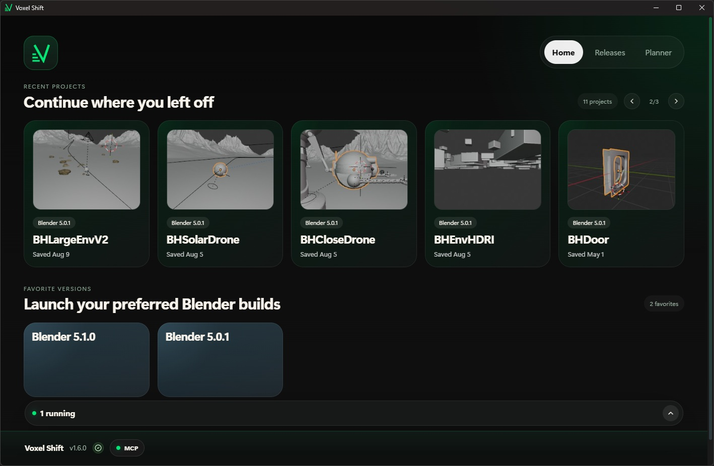
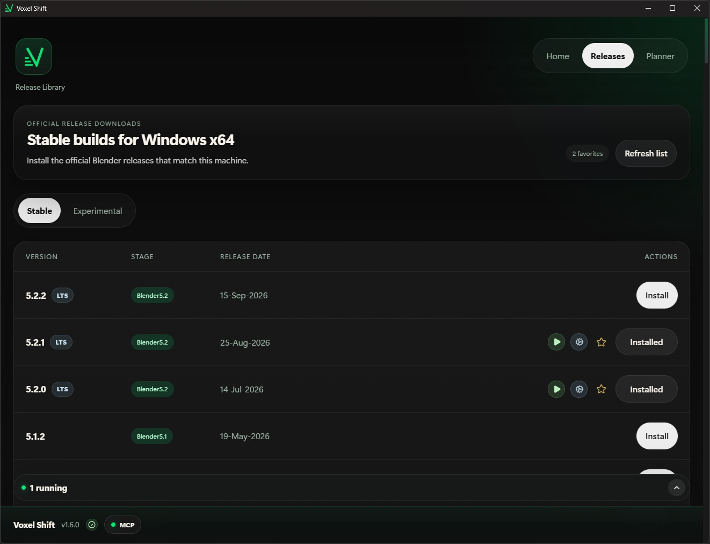

# Voxel Shift

[](https://coveralls.io/github/CGSeb/voxelshift?branch=main)
[](https://github.com/CGSeb/voxelshift/releases/latest)

Voxel Shift is an open source desktop app for managing Blender versions, reopening projects, and scheduling background renders.

Version **1.6.0** adds an embedded MCP server for compatible AI assistants. See the [release notes](release-notes/1.6.0.md).



## Download

Get a Windows or Linux build from [GitHub Releases](https://github.com/CGSeb/voxelshift/releases). The app includes update notifications and installation controls. macOS packages are not currently available.

## Features

### Blender library and projects

Manage multiple Blender versions, choose a default, and favorite versions for quick access. Reopen recent projects with their associated Blender version and browse project thumbnails.

### Releases and migration

Browse and install official stable releases and experimental daily builds. Each managed installation has its own portable setup. Transfer settings, extensions, and legacy add-ons from an existing setup, with options to copy or link extensions.



### Saved configurations

Save named configuration snapshots and apply them to other Blender installations to reuse preferences, startup files, and themes.

### Running sessions

Monitor Blender sessions launched through Voxel Shift, view their logs, and stop running instances.

### Render planner

Schedule animation renders with a frame range, start time, Blender version, and optional output folder. Track progress, estimated time remaining, and logs; edit pending jobs and duplicate existing jobs.

Jobs run sequentially while Voxel Shift is open. Cancel pending or running renders, retry failed or cancelled renders, pause/resume the queue, and move pending jobs up or down. Pausing lets the current render finish. Queue order and pause state survive restarts; scheduled times remain the earliest allowed start, so future jobs do not block ready jobs.

Retries start from the first frame with the same settings and keep the original history; existing outputs may be overwritten. Completion and failure produce notifications in the app and native desktop notifications (subject to system notification settings; Windows native notifications require an installed app). Native file/folder pickers and optional shutdown after rendering are currently Windows-only.

### MCP integration

The embedded local MCP server provides **40 tools** for managing Blender versions, projects, sessions, installations, configurations, and render jobs. Actions performed by a client also update the app UI.

Click **MCP** in the bottom bar to enable the server and configure its port. Connect a compatible local client using the URL and access token shown in the settings. Voxel Shift must remain open.

See the [MCP guide](mcp/README.md) for setup, supported tools, and troubleshooting.

## Roadmap

Planned priorities, in order; scope and timing may change:

1. **Render control (implemented):** cancel and retry renders, pause and reorder the queue, and add completion/failure notifications.
2. **Installation and migration recovery:** resume interrupted downloads, back up configurations, support rollback, and detect broken extension links.
3. **MCP usability:** expose progress for long operations, test connections, and add token regeneration and access controls.
4. **Background operation:** keep scheduled work running when the window closes and improve recovery after app restarts.

## Development

Built with Tauri, React, TypeScript, and Rust. Development requires Node.js, npm, Rust, and the platform's Tauri build prerequisites.

```sh
npm ci
npm run tauri dev
```

Build desktop packages with `npm run tauri build`. Run frontend tests with `npm test` and backend tests with `cargo test --manifest-path src-tauri/Cargo.toml --lib`.

## Contributing

Issues and pull requests are welcome. Include your operating system, app and Blender versions, reproduction steps, and relevant logs in bug reports. Remove access tokens before sharing logs or configuration files.

## License

Voxel Shift is licensed under GPL-3.0-or-later. See [LICENSE](LICENSE).
